# Получение уведомления

На первом скриншоте видно что приходит уведомление что за указанный период цена закрытия колебалась
более 10%

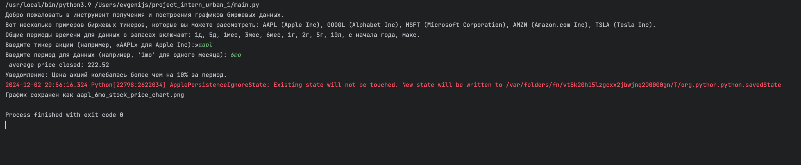

# Экспорт данных в файл

так же в программе предусмотрен экспорт данных в csv файл

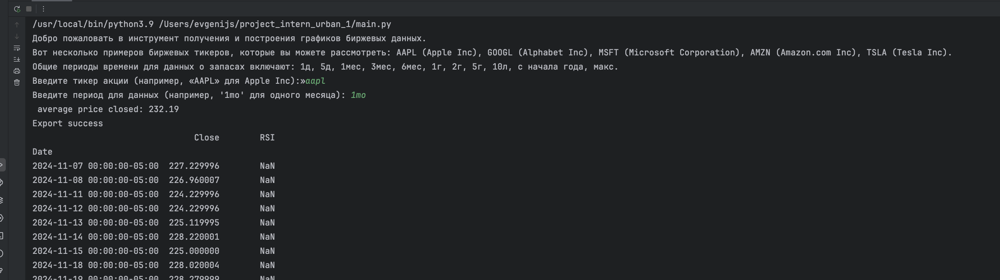

# Отображения rsi на графике

за отображение отвечает функция:  
def create_and_show_rsi_plot(data, ticker, period, filename=None):

а за вычисление:  
def calculate_rsi(data: DataFrame, window=14):

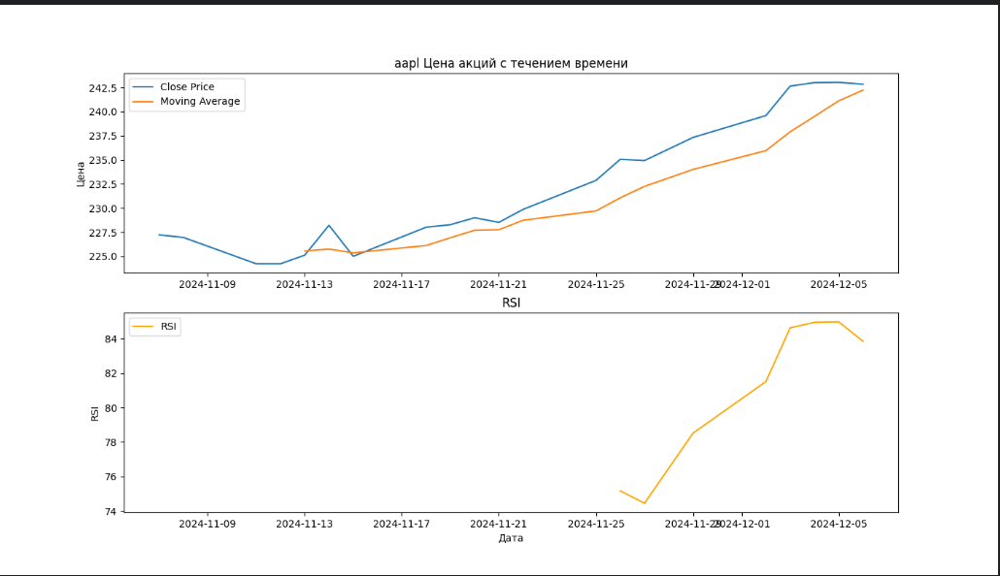

# Указание для отображения нужного периода

- можно не указывать тогда будут выведенны даты за указанный вначале программы период например "1mo" 
   
  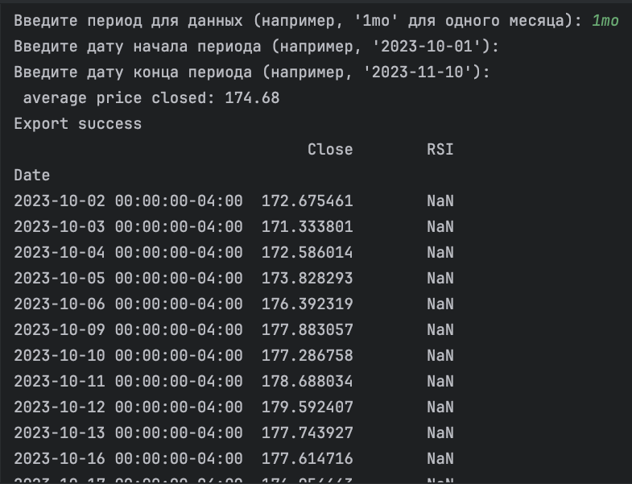 
   
- Так же следует учесть что если вы у казали период 1mo то и при указании конкретнной даты учитывайте что будет показан
  промежуток за указанный период

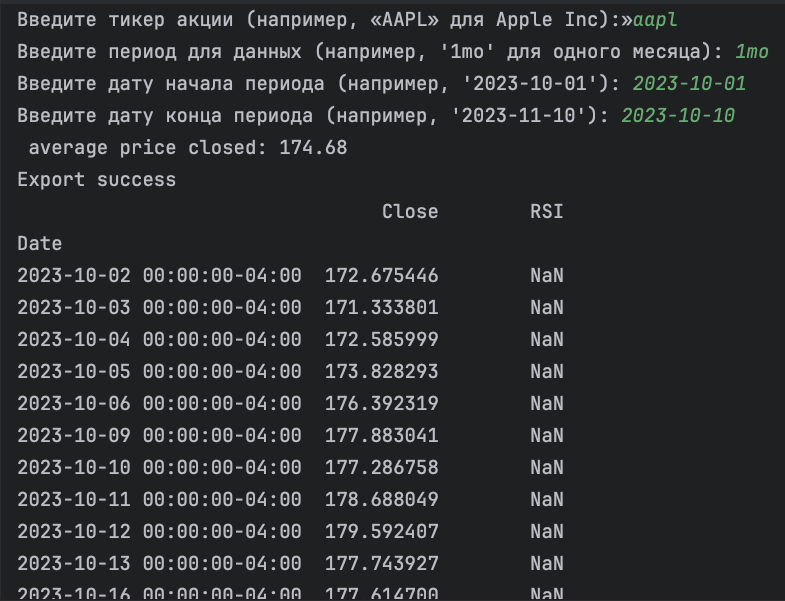  

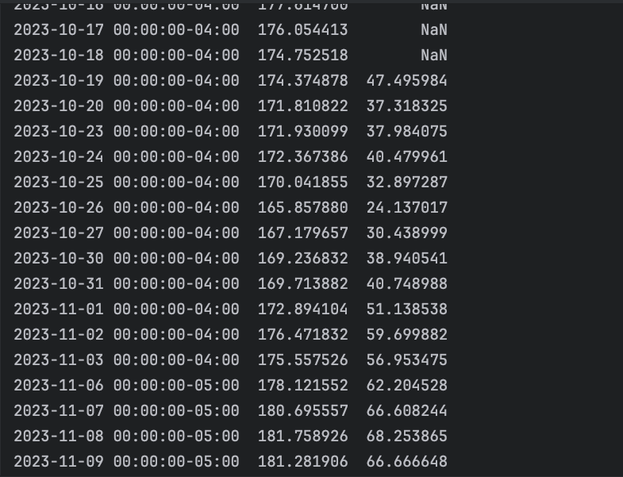

# Выбор стиля графика

## В приложении предусмотрен выбор стиля графика  

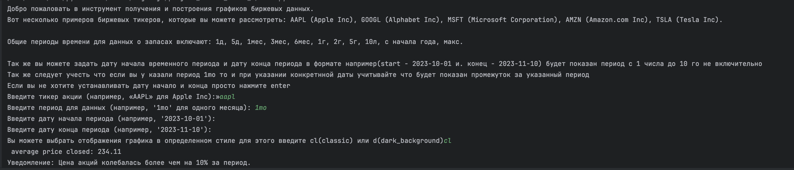

- класический вариант

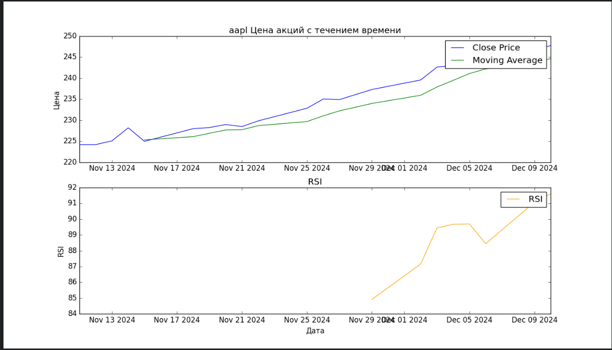  
- и с темной темой

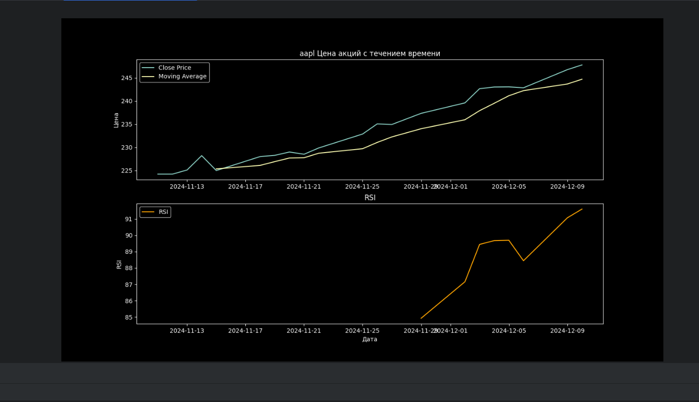

## Если стиль пропущен пользователем(нажать ентер) то будет отображен график по дефолту

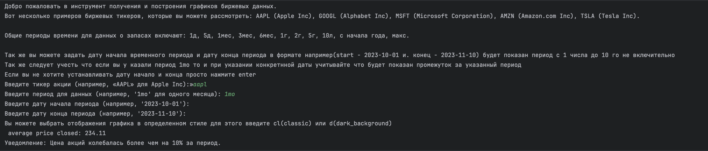

- дефолтное отображение

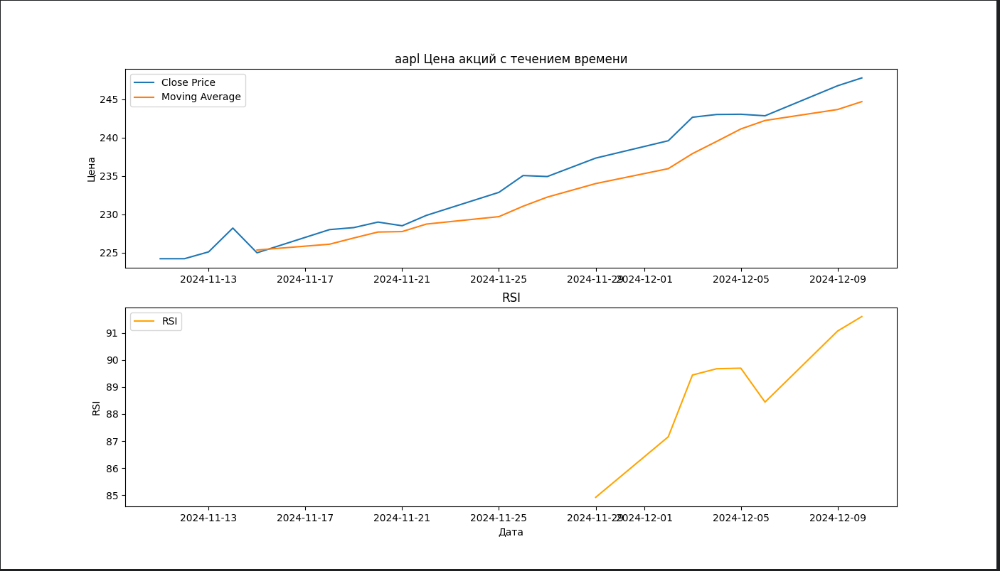

# Отображение статистического индикатора - "стандартного отклонения цены закрытия"

за отображение отвечает функция:  
def create_and_save_plot_indicators(data, ticker, period, filename=None):

- график  

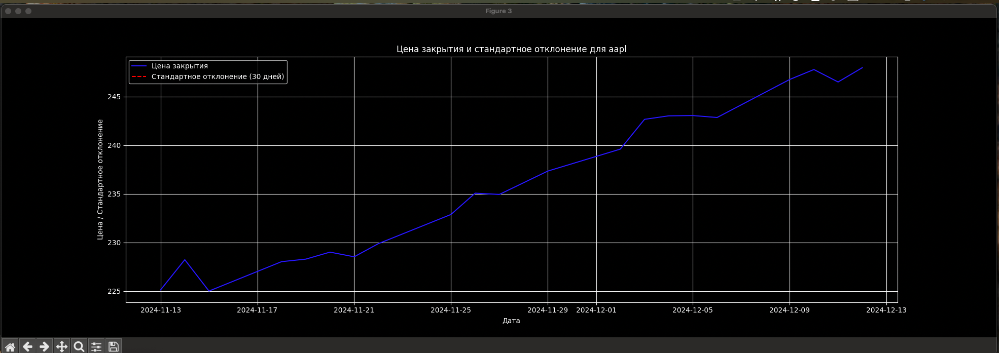

# Создание интерактивного графика

за отображение отвечает функция:  
def create_interactive_plot(data)

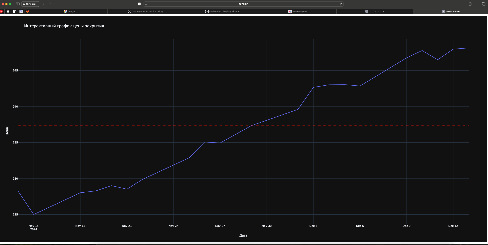